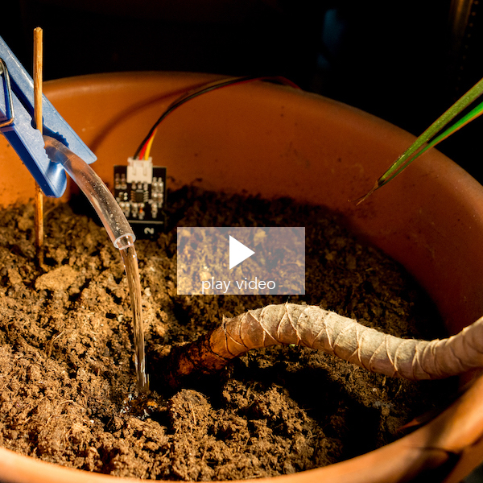
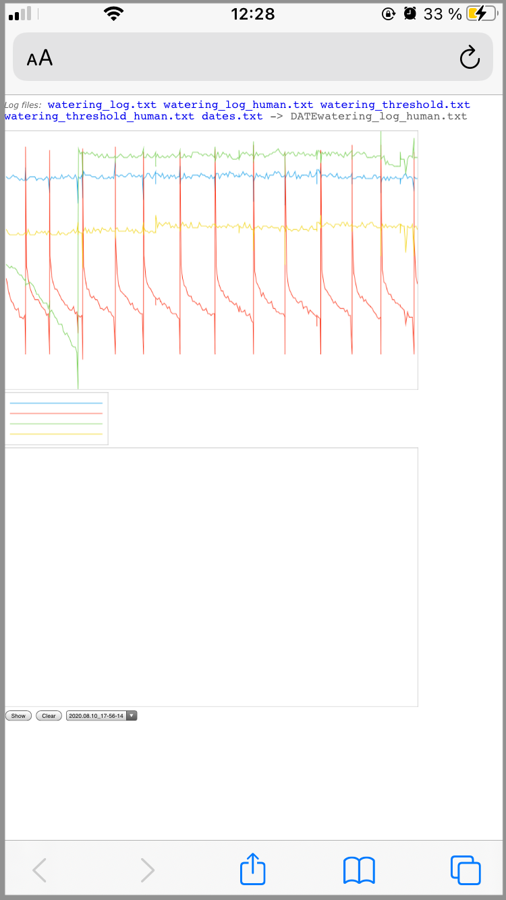
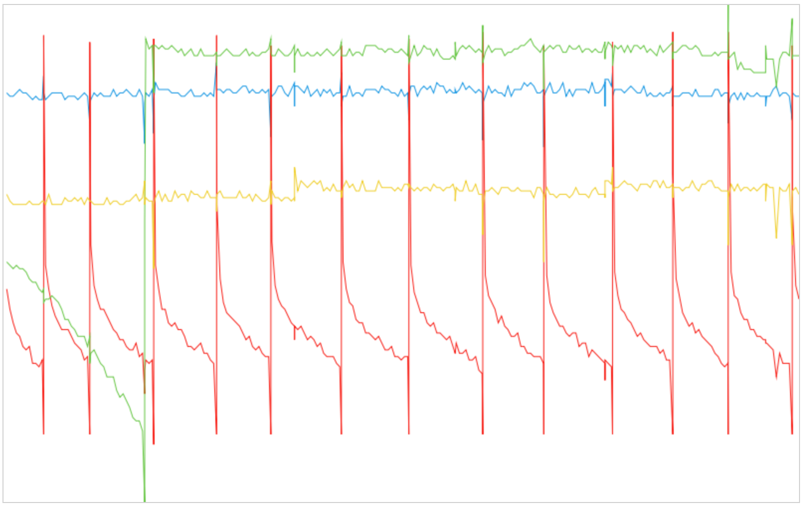
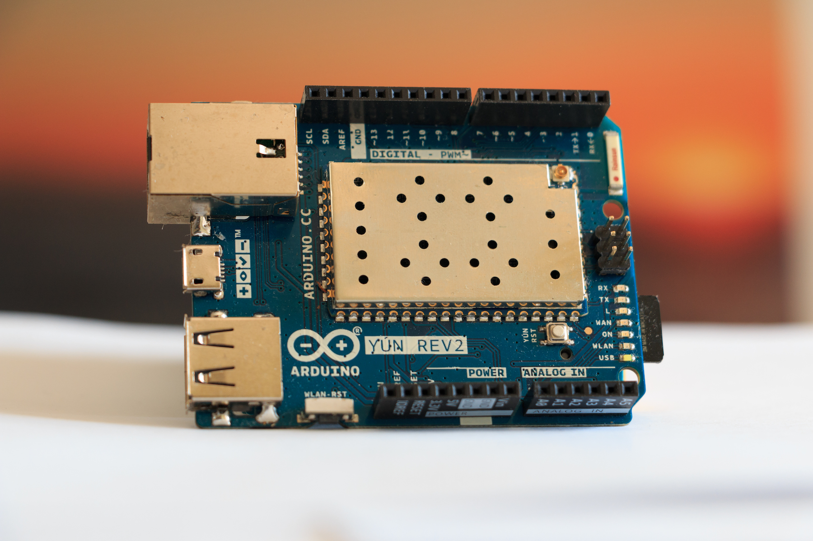
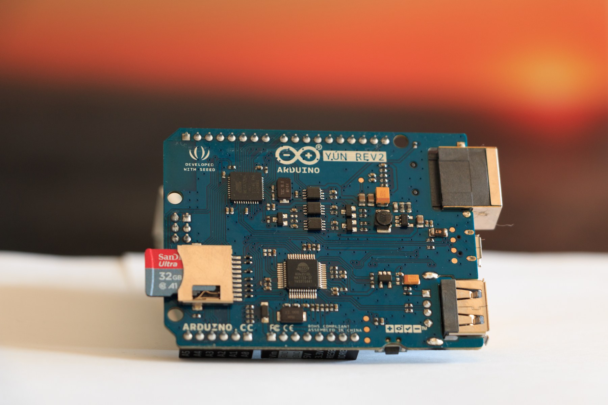
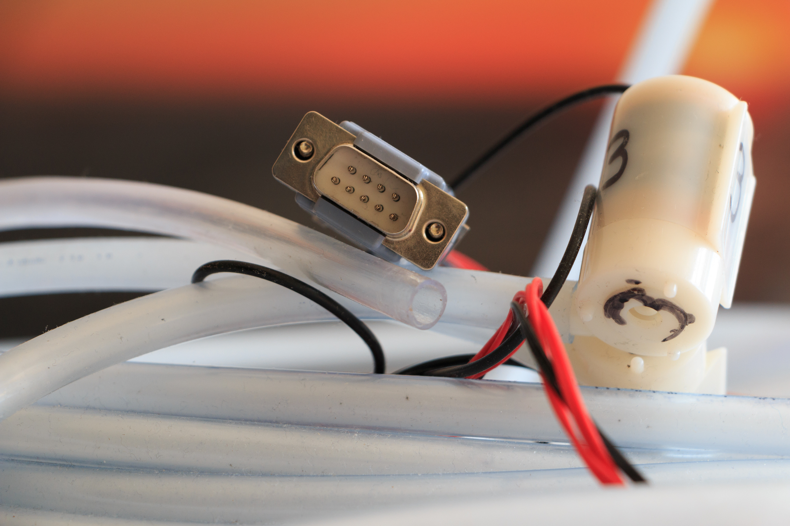
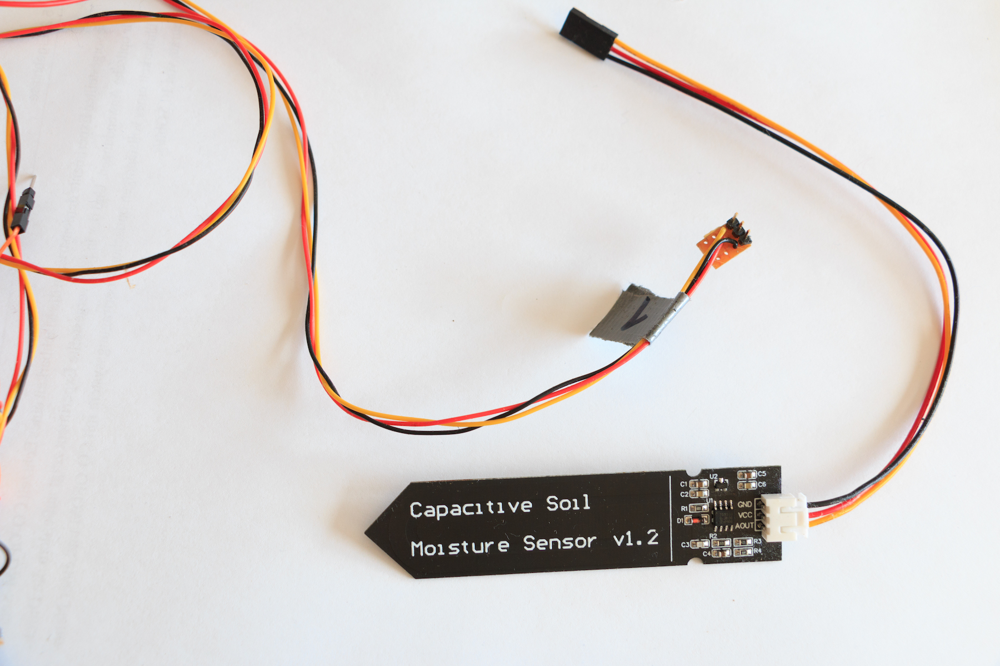
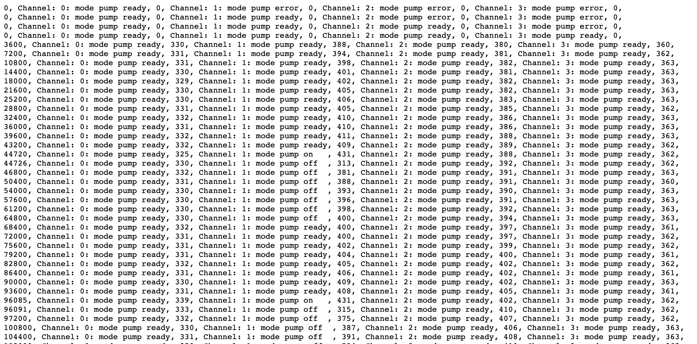

# IoT Watering System
Automatic irrigation of plants on vacation.

For this self watering system you need an Arduino microcontroller, water pump, relais module and a capacitive soil moisture sensor. For example "WayinTop Automatische Bewässerung DIY Kit". It works with Arduino Nano and Arduino Yún.

Using Arduino Yún: Settings and log files are stored on a SD card. Also settings like threshold values and log files will be pushed to a user defined server. An HTML file evaluates the log file and shows graphically the data by remote on mobile phone or notebook.

This software supports:
* start pump when moisture of soil is too low
* start pump after time out (e.g. after one day)
* stop pump when moisture is high enough or after a timeout (e.g. at least after 20 seconds)
* interact via terminal (seriell monitor of arduino IDE):
  - check sensor values
  - start and stop pump manualy
  - change values of variables during runtime (thresholds, time durations)
  - activate debug mode: print sensor values continously and internal states of software.
  - get log data (sensor data will be recorded every hour)
  - start auto calibraton
* Internet of Things (IoT) with Arduino Yún:
  - save log files and settings on SD card
  - push files to a server
  - evaluate log files and show graphically from remote

# Hardware Setup
Connect digital outputs of arduino (microcontroller) with relais module inputs. Connect analog inputs of arduino with capacitive soil moisture sensors. Connect pumps with relais module switches and power supply. Make sure to use correct voltages for arduino board and pump.

# Terminal
Type 'h' to show help.
* __d__ _debug_: Print continously debug informations
* __s__ _soft reset_ : reset timer and switch off pump
* __r__ _reset_: hard reset all values, thresholds, timer values and switch off pump
* __i__ _short info_: print value of sensors
* __t__ _terminal_: interact with software and change threshold and timer values
* __m__ _manual mode_: switch on and off each pump manually
* __l__ _read log_: read log values of each channel
* __a__ _auto calibration_: wizard to set threshold values
* __w__ _write settings_: write settings to SD card and push them to server
* __c__ _cancel_: go back to main software functionality from each menu point

_Hint_: Connect reset pin with 10 k Ohm pull up resistor and 10 nF capacitor against ground to avoid reset when connecting computer via USB cable to running system. Otherwise internal log data will be cleared. When using Arduino Yún this is not necessary: log files will be stored on SD card and on server.

## Change Values
Type 't' and information of all channels is printed. Type channel number to edit values for the specific channel. To change _threshold low_ for example type 'S1' and afterwards type new value. With 'c' the main program is continued. Type again 't' to check the values and 'c' to continue again.

## Auto Calibration
Type 'a'. Afterwards type channel number. Make sure sensor is dry. Then type '1'. Pump is switched on. When watering is sufficient then type '0' to stop pump. The sensor values are taken to set the new threshold.

# IoT

When using Arduino Yún the access to the Arduino board can be done in your WLAN environment. E.g. to setup the watering system like setting threshold values. Every hour log data are recorded and sent to a user defined server. So it is possible to check the watering system by remote using a mobile phone for example. The log data are stored in a human readable version and also a graphically evaluation can be shown on your mobile phone.

## Evaluation Example

Here an example of an evaluation is shown (e.g. on your mobile phone during holiday, notebook, etc.). It shows that one plant (red line) was watered several times. Another plant (green line) only once. For two plants (blue and yellow line) the moisture was nearly constant in the shown time.

# Supported Requirements
This software supports following requirements:
* R1: If pump is activated (on) then after time T1 there shall be a moisture change (below threshold S3). Otherwise go to error state. And the minimum watering time is T1.
* R2: If moisture is lower than threshold S1 then pump has to be activated.
* R3: If moisture is higher than threshold S2 then pump has to stop.
* R4: Maximum time for activated pump time T2.
* R5: Wait at least time T3 before activating pump again.
* R6: If after time T4 soil is still too wet then start pump (maybe sensor is defect).
* R7: Leave error state after time T5 and go to ready state (new trial to water plants).
* R8: Requirements R1 - R7 works independent for each available pump.

States/Modes:
* M1: pump is ready
* M2: pump is on
* M3: pump is off
* M4: pump is in error state

# Setup for Arduino Yún
A micro SD card is required for saving data and an FTP server access for pushing data to server and evaluation.

The location will be _/mnt/sd/watering_. Make sure this folder does exists.

Copy _pushToServer.sh_ script to Linux system of Arduino Yún and modify it. (FTP server name with root path, user name and password).
Upload _evaluation.html_ to the server for evaluating data.

# Further Images
## Required Hardware
Here Arudino Yún. Arudino Uno can also be used but have no internet access.

Arduino Yún with SD card:

Relais module with battery holder and D-SUB connector for easy setup.

Pump with hose and D-SUB connector.

Capacitive soil moisture sensor with connector.

## Remote Access
With Arudino Yún settings and log data are pushed to an user defined server. So they can be read out remotly.

Here an example of settings:

Beside graphically visualisation log file can be read out as text:

